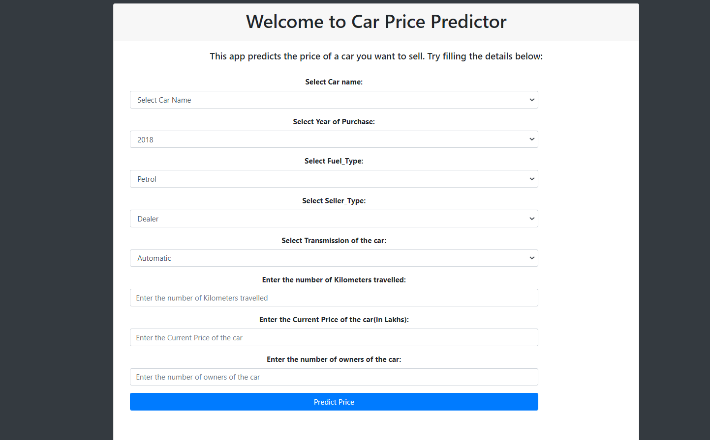
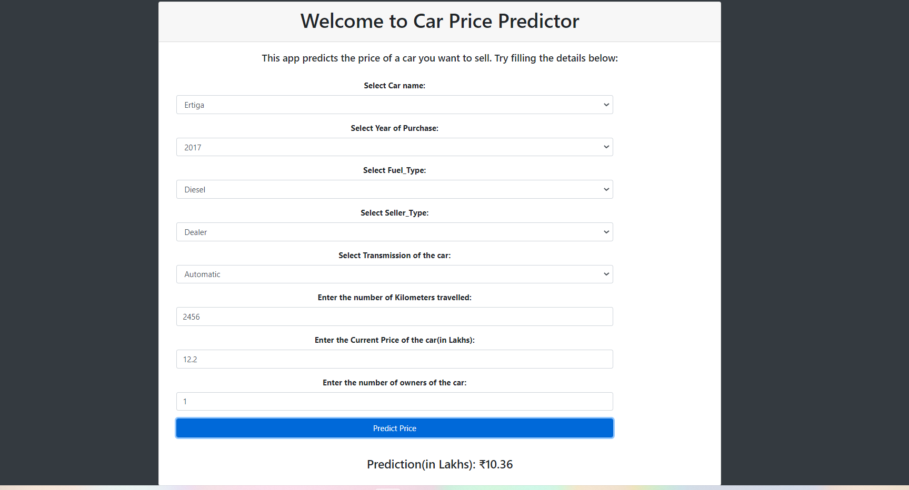

# UsedCarPricePrediction

# Aim
This project aims to predict the Price of an used Car by taking the car name, year of purchase,kms driven,fuel type,seller type, etc.

# Description
# What this project does?
This project takes the parameters of an used car like: Car name,Year of Purchase, Fuel Type and Number of Kilometers it has been driven, Seller Type, Number of owners and transmission of the car.
It then predicts the possible price of the car. For example, the image below shows the predicted price of our Ertiga.

# How this project does?
1. First of all the data was scraped from https://www.kaggle.com/datasets/nehalbirla/vehicle-dataset-from-cardekho?select=car+data.csv)
   Link for data: 

2. The data was cleaned.

3. Then a Linear Regression model was built on top of it which had 0.93 R2_score.

4. Link for the notebook: 

5. This project was given the form of an website built on Flask where we used the Linear Regression model to perform predictions.
